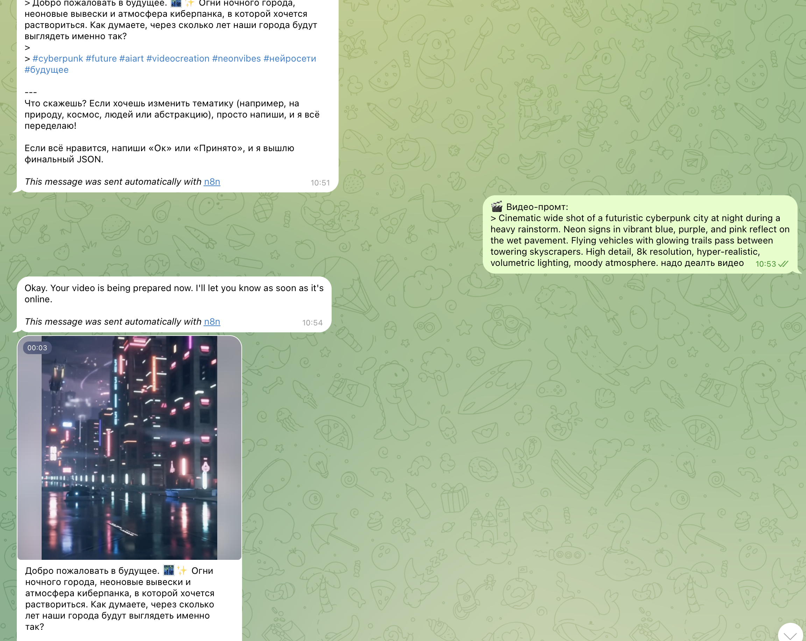
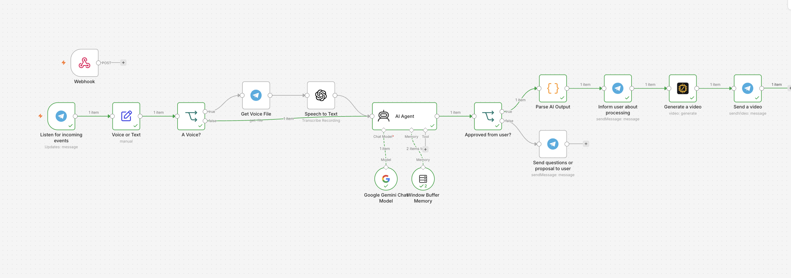

# 🤖 Telegram AI Video Bot

Telegram bot that creates AI-generated videos from text prompts and automatically posts them to social media platforms.

## ✨ Features

| Feature | Description |
|---------|-------------|
| 🎬 **AI Video Generation** | Generate videos from text prompts using deAPI |
| 🗣️ **Voice Support** | Send voice messages, bot converts to text |
| 📝 **Smart Prompt Assistant** | AI helps refine your video ideas |
| 🚀 **Auto-Publishing** | Post to Instagram, TikTok, Facebook |
| 💾 **Google Sheets Logging** | Save all generated prompts and captions |
| 🌍 **Multi-language** | Works with Russian, Uzbek, English |

## 🛠️ Tech Stack

| Technology | Purpose |
|------------|---------|
| **n8n** | Workflow automation |
| **deAPI** | AI video generation (LTX-2.3) |
| **Telegram Bot API** | User interface |
| **Google Gemini** | AI prompt assistant |
| **Meta Graph API** | Social media publishing |

## 📊 Workflow Architecture
User Message → AI Prompt Assistant → Approval → Video Generation → Social Media Post

1. User sends text/voice to Telegram bot
2. AI analyzes and creates video prompt + caption
3. User approves or requests changes
4. deAPI generates video (9:16 portrait)
5. Video posted to Instagram, TikTok, Facebook
6. All data saved to Google Sheets

## 🚀 Installation

### Prerequisites

| Credential | Where to get |
|------------|--------------|
| Telegram Bot Token | [@BotFather](https://t.me/botfather) |
| deAPI Key | [deapi.ai](https://deapi.ai) |
| Google Gemini Key | [Google AI Studio](https://aistudio.google.com) |
| Meta Graph API | [Facebook Developers](https://developers.facebook.com) |

### Setup Steps

1. **Import workflow to n8n**
   - Download `workflow.json`
   - n8n → Import → From File

2. **Configure credentials**
   - Telegram Bot Token
   - deAPI API Key
   - Google Gemini API Key
   - Meta Graph API (optional)

3. **Activate workflow**
   - Click "Active" button in n8n

4. **Test the bot**
   - Send `/start` to your Telegram bot
   - Type: *"Create a video about cyberpunk city"*
   - Say "approved" to generate video

## 📸 Demo

## 🔧 Example Commands

| User says | Bot action |
|-----------|------------|
| "Create a winter forest video" | Generates prompt, asks for approval |
| "Make it more dramatic" | Refines prompt |
| "approved" | Creates video and posts |

## 💰 Pricing

| Service | Cost |
|---------|------|
| n8n (self-hosted) | Free |
| deAPI | $5 free credit then pay-per-use |
| Telegram Bot | Free |
| Meta API | Free (up to limits) |

## 👨‍💻 Author

**Navruzbek Bobobekov** - Automation & AI Developer

## 📄 License

MIT - Free to use and modify
